# Lab Walkthrough: Cloud-Based AD Setup & User Management

This is a narrative walkthrough of the lab as it was actually performed — including the real troubleshooting that came up along the way, not just the "happy path." For the original formatted lab report, see [`CloudBased_AD_Setup_and_User_Management.pdf`](CloudBased_AD_Setup_and_User_Management.pdf).

---

## 1. Provisioning the Domain Controller (DC01)

DC01 was deployed as a Windows Server 2022 VM in Azure, sized for a lightweight lab workload (`Standard_B2als_v2`).

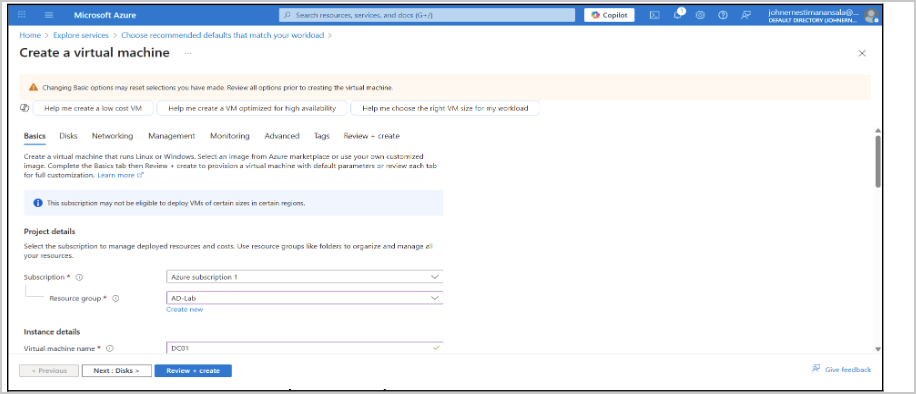

*Evidence — DC01 VM creation, Basics tab*

**Gotcha:** the image was initially left on **Windows Server 2022 Datacenter – Server Core**, which has no desktop GUI. Server Core can't run Server Manager or the graphical AD DS promotion wizard used in the next step, so the image had to be **Desktop Experience** instead — worth checking before deployment, since fixing it after the fact means redeploying the VM.

---

## 2. Promoting DC01 to a Domain Controller

After installing the **AD DS** and **DNS Server** roles via Server Manager's "Add Roles and Features" wizard, DC01 was promoted through the notification flag to create a brand-new forest: `corp.local`.

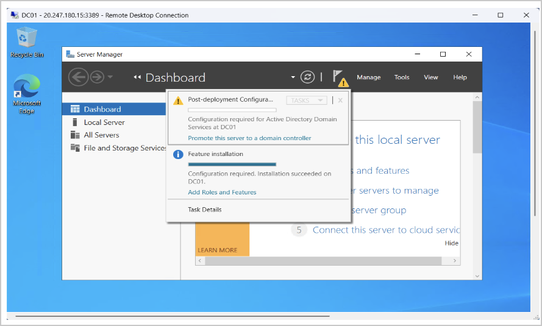

*Evidence — promotion wizard triggered from Server Manager*

The Forest/Domain Functional Level defaulted to **Windows Server 2016** — this is expected and not a mistake. AD functional levels have been capped there across several newer Windows Server releases, so there's no higher option to select even on a fresh 2022 deployment.

A **DSRM (Directory Services Restore Mode)** password was also set during this step — a separate local recovery password used only if the AD database ever needs offline repair. It's easy to overlook since it's just one field in the wizard, but it's the only way back in if the domain admin password is ever lost *and* Azure's own password-reset tooling fails.

---

## 3. Joining CLIENT01 to the Domain — the real troubleshooting

This is where most of the actual debugging happened.

### 3.1 First attempt — DNS pointed nowhere useful

CLIENT01's DNS server needs to point at DC01 *before* a domain join will succeed, since domain lookups resolve through DNS, not IP alone.

```cmd
ipconfig /all
nslookup corp.local
```

Setting the wrong IP as the DNS server produced this failure when attempting to join:

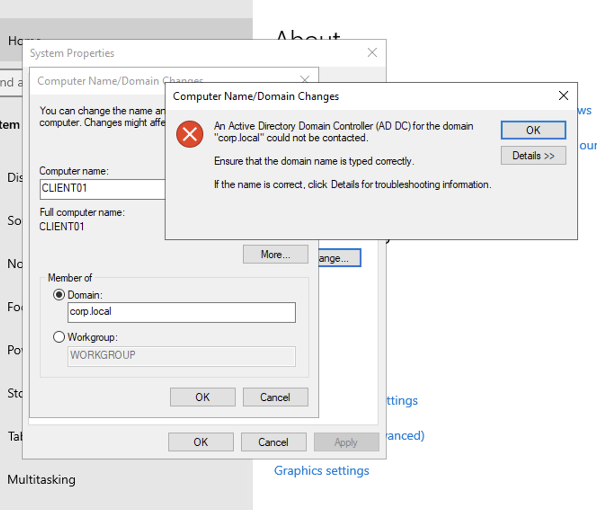

*Evidence — "AD DC could not be contacted" error during domain join*

### 3.2 The real root cause — two VMs, two networks

Checking each VM's private IP in the Azure Portal, both DC01 and CLIENT01 appeared to have the identical private IP `172.16.0.4`:

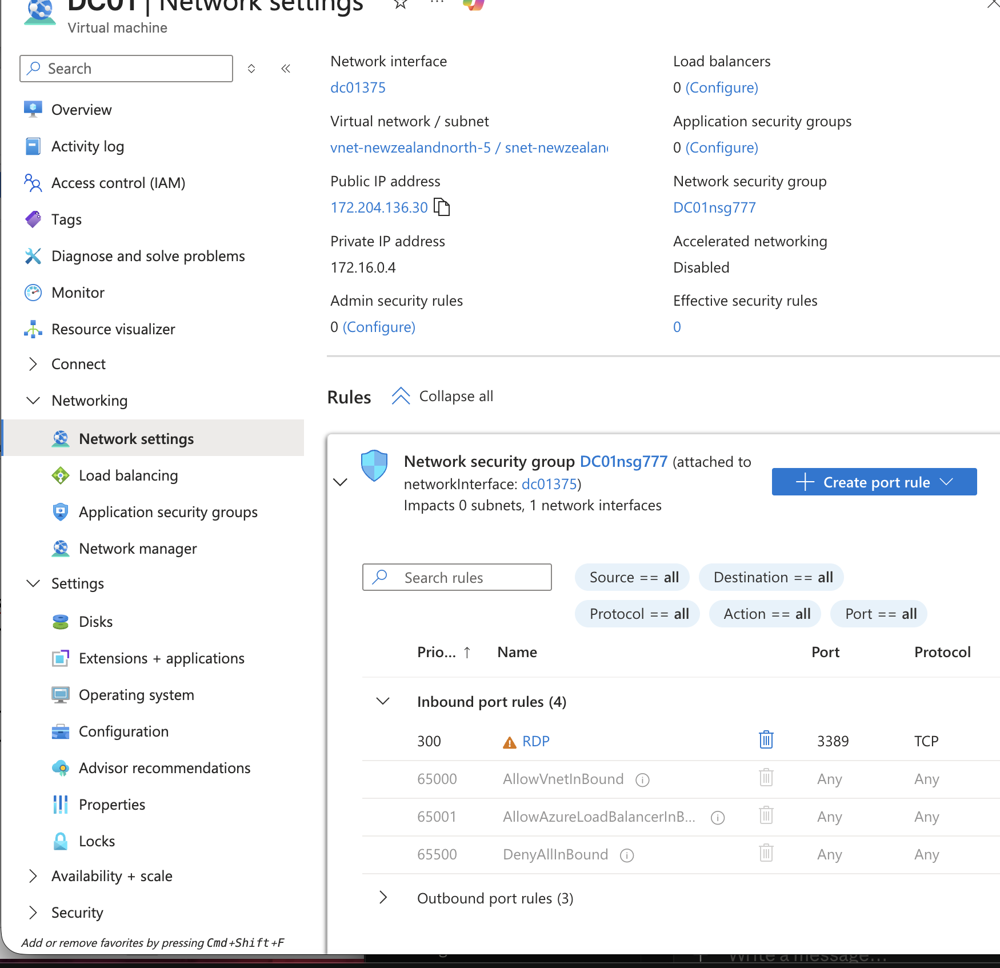
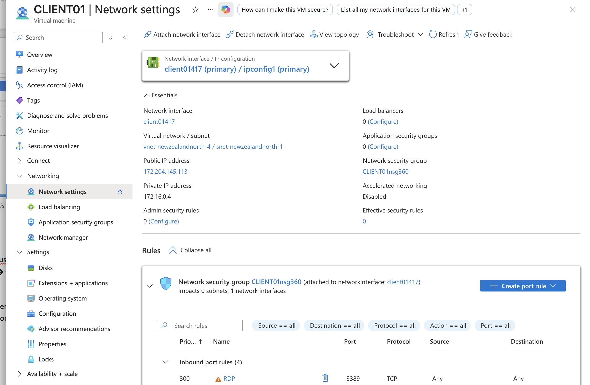

*Evidence — DC01 (`vnet-newzealandnorth-5`) vs. CLIENT01 (`vnet-newzealandnorth-4`) — two separate Virtual Networks*

The two VMs were never on the same network — each VNet independently assigned `.4` as its first usable address, which is why the addresses looked identical while the machines were actually unreachable from each other. Azure's VM creation wizard defaults to spinning up a **new** VNet per VM unless the existing one is explicitly selected.

**Fix:** CLIENT01 was recreated, explicitly selecting DC01's existing Virtual Network and subnet on the Networking tab:

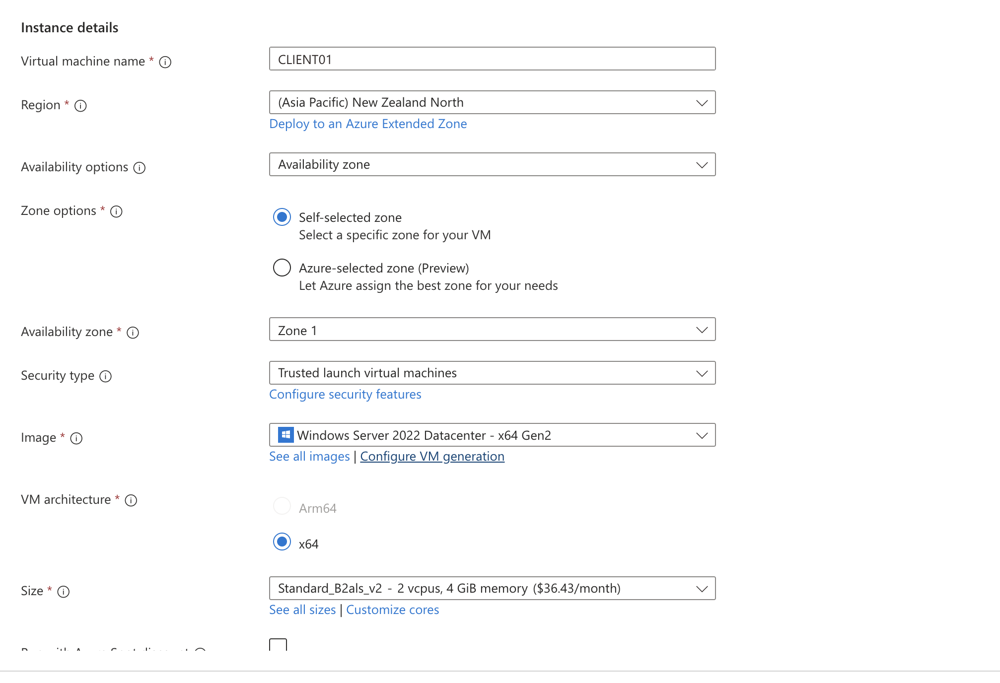
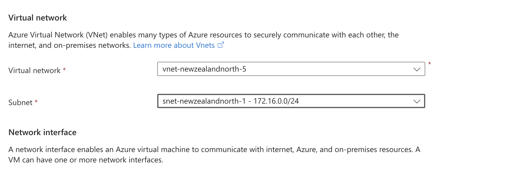

*Evidence — Virtual network explicitly set to `vnet-newzealandnorth-5` (DC01's network) instead of the auto-generated default*

Once both VMs shared a real network, setting CLIENT01's DNS to DC01's actual private IP and re-running `nslookup corp.local` resolved correctly, and the domain join completed.

### 3.3 A second gotcha — local account vs. domain account

Right after joining, `whoami` unexpectedly returned a **local** account instead of a domain one:

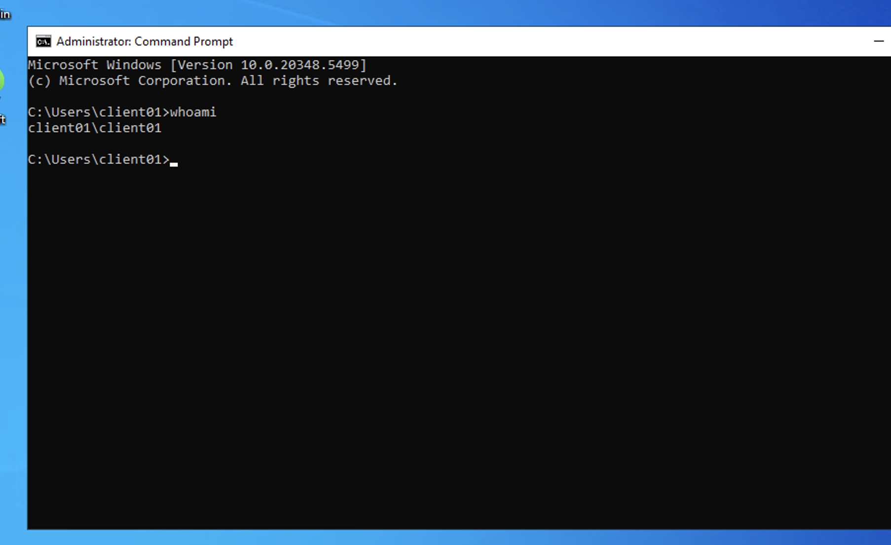

*Evidence — `client01\client01` — signed back in via the existing session tile rather than a fresh domain sign-in*

The fix was signing out completely and choosing **Other user** at the lock screen, then explicitly entering `corp\<username>` — simply clicking the existing account tile reuses the local session instead of prompting a real domain logon:

```cmd
whoami
```

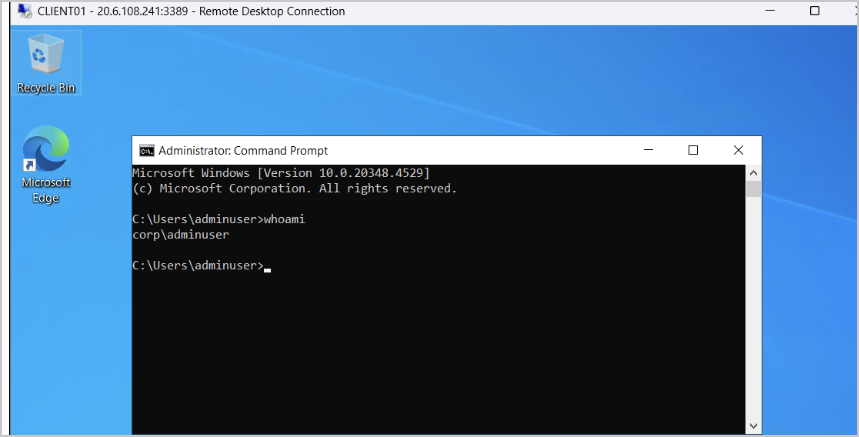

*Evidence — `corp\adminuser` confirms a genuine domain logon*

---

## 4. User & OU Provisioning

An Organizational Unit and domain user accounts were created in Active Directory Users and Computers (ADUC):

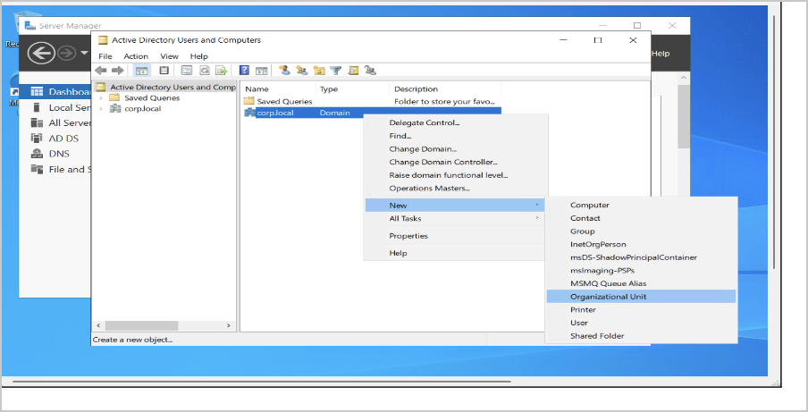
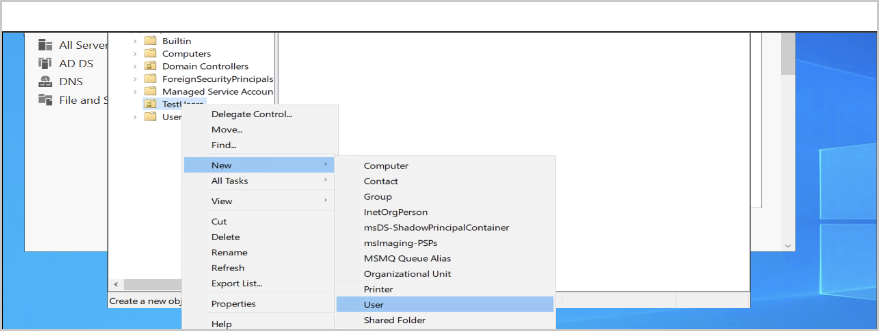

*Evidence — `TestUsers` OU and domain user creation*

A password reset was performed with "user must change password at next logon" unchecked (to avoid a forced-change loop mid-lab), and the test user was added to the local **Remote Desktop Users** group on CLIENT01 so they could RDP in directly:

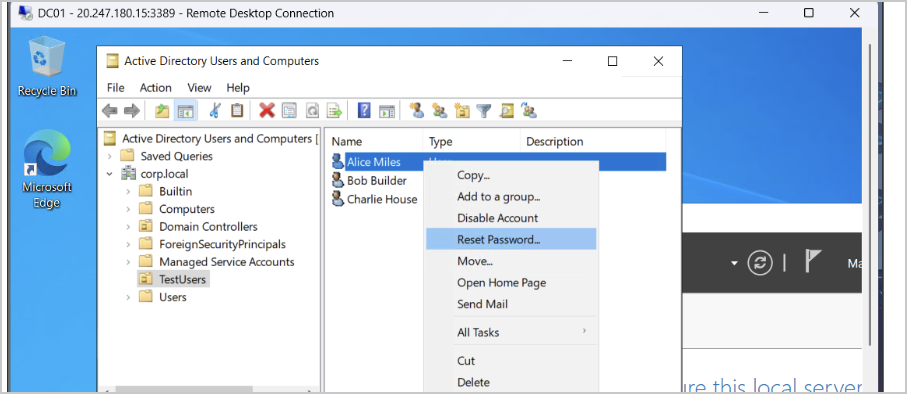
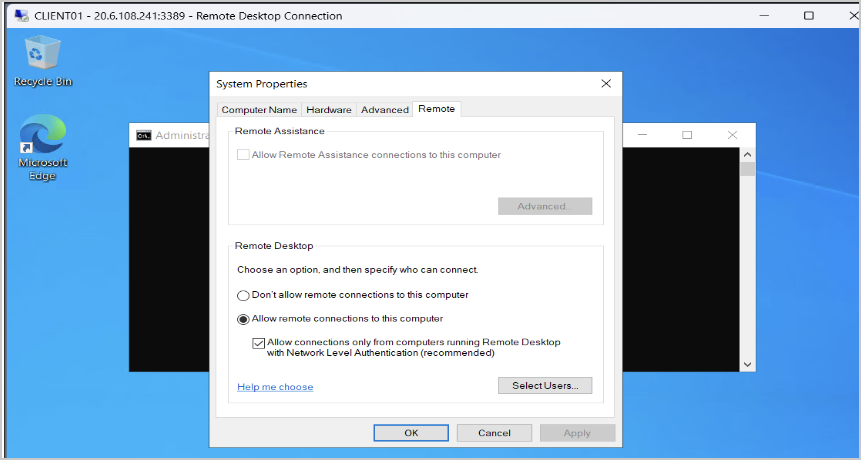

*Evidence — password reset and Remote Desktop Users group membership*

---

## 5. Access Validation

Logged in as the domain user end-to-end and confirmed both authentication and basic network reachability to the DC:

```cmd
whoami
ping DC01
```

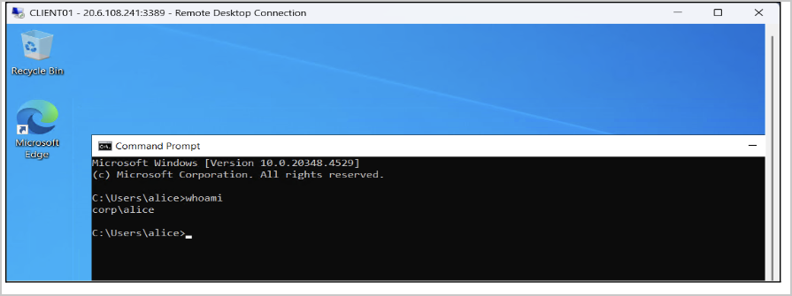
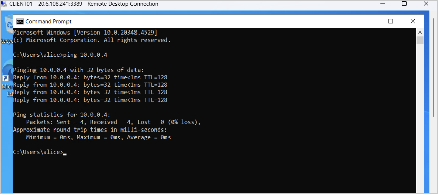

*Evidence — domain user authenticated and can reach DC01 over the network*

---

## 6. Security Monitoring — Reading the Signal Out of the Noise

With the environment fully stood up, DC01's Security event log was reviewed and filtered for the Event IDs that matter for SOC-style monitoring (4624/4625/4648 for authentication, 4720–4726 for account management, 4732/4733/4735 for group changes).

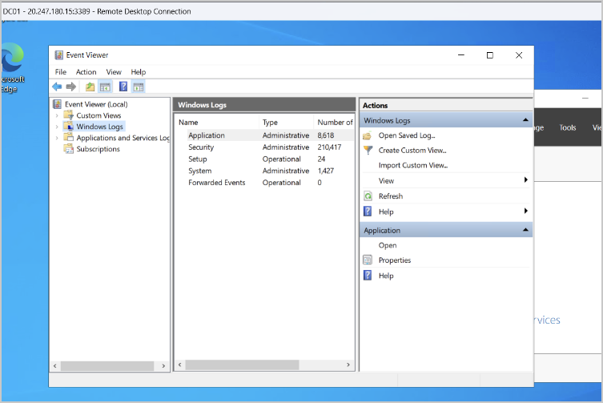

*Evidence — Event Viewer filtered on the Security log*

### Filtering out expected noise

A large share of raw entries turned out to be internal Windows/AD housekeeping rather than anything user-driven — for example, `4648` events where the `DC01$` machine account authenticates to *itself* via routine processes like `taskhostw.exe`, or `4735` events attributed to `ANONYMOUS LOGON` generated automatically during the DC promotion step (built-in RODC-related group setup), not by any real user.

Event Viewer's basic filter UI can't exclude by pattern directly, but its XML/XPath tab or PowerShell both can:

```powershell
Get-WinEvent -LogName Security -FilterHashtable @{Id=4648} |
Where-Object {
    $_.Properties[1].Value -notlike '*$' -and
    $_.Properties[5].Value -ne 'DWM-1'
}
```

This excludes machine-account subjects (anything ending in `$`) and known internal targets (`DWM-1`, the Desktop Window Manager's own session), leaving a much shorter, more meaningful list to actually review — the same kind of exclusion logic used in real SIEM queries to cut through log volume and surface genuine signal.

---

## Key takeaway

The biggest lesson from this lab wasn't any single AD DS setting — it was that **a misleading symptom (identical private IPs) had a completely different root cause (two isolated VNets)**, and that most of a raw Security log is expected noise that has to be actively filtered out rather than treated as suspicious by default. Both are exactly the kind of pattern-recognition a SOC analyst builds through hands-on repetition rather than reading alone.
